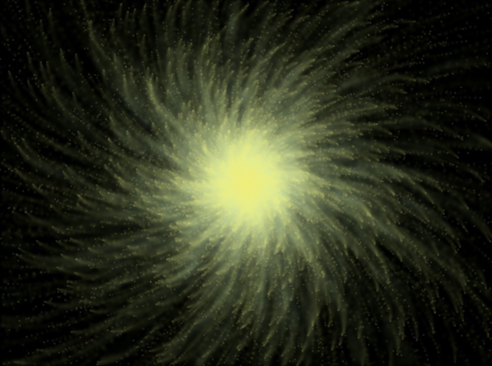
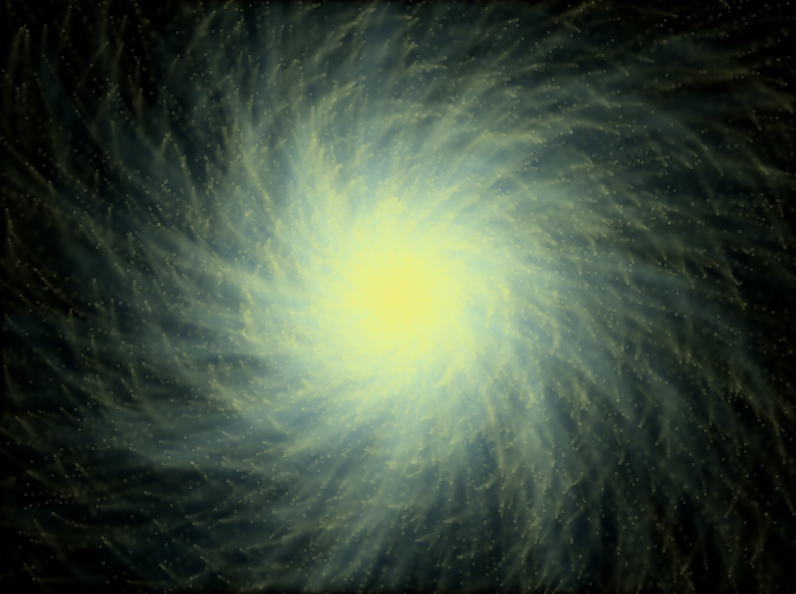
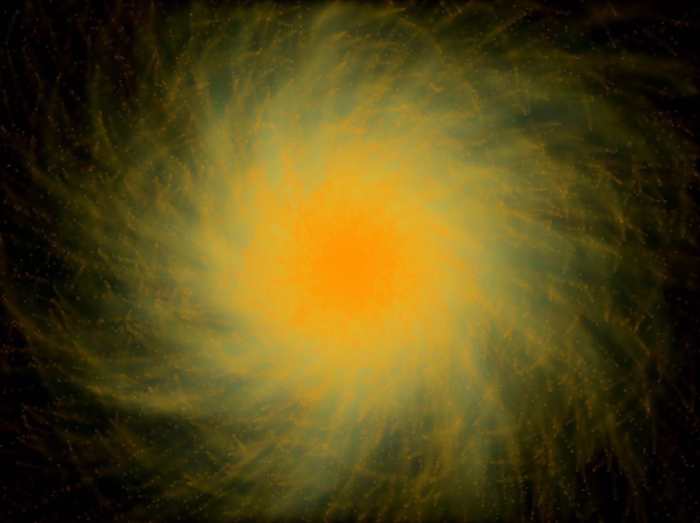
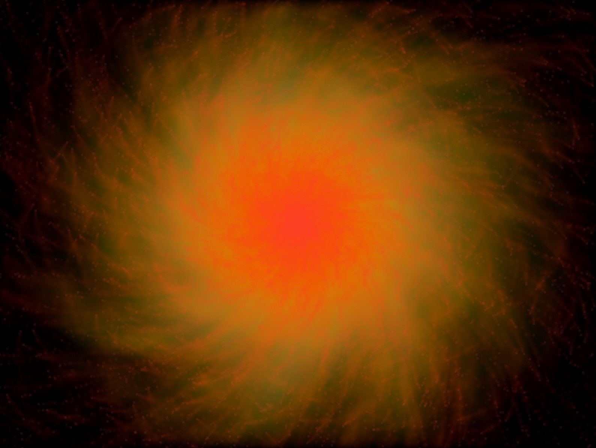

# Particle Fire Explosion

* This program is the keystone project from the free C++ tutorial by John Purcell/Cave of Programming on Udemy.
* This program creates a window and displays something of an explosion simulation with small particles flying around and changing color. 

## Screens shots

</img>

</img>

</img>

</img>
